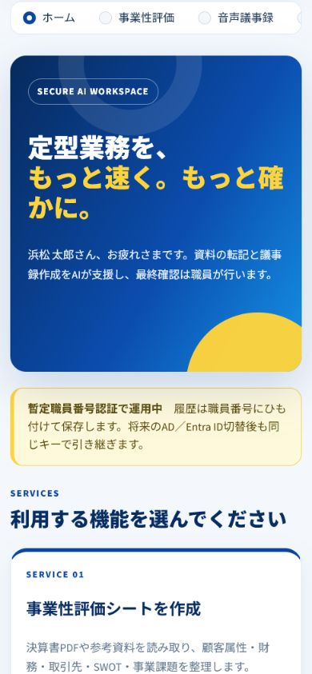
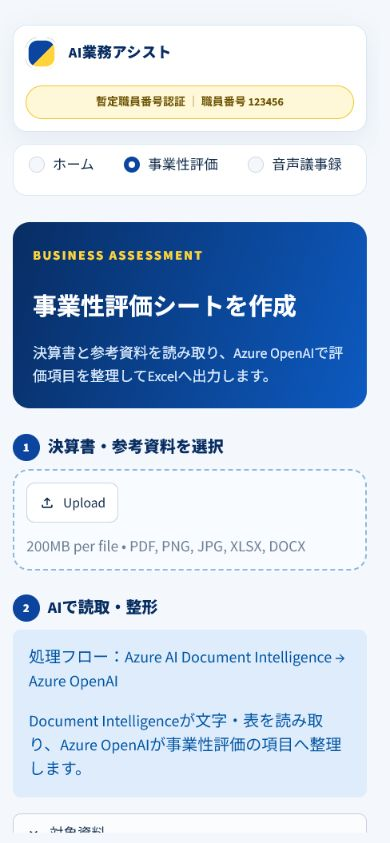
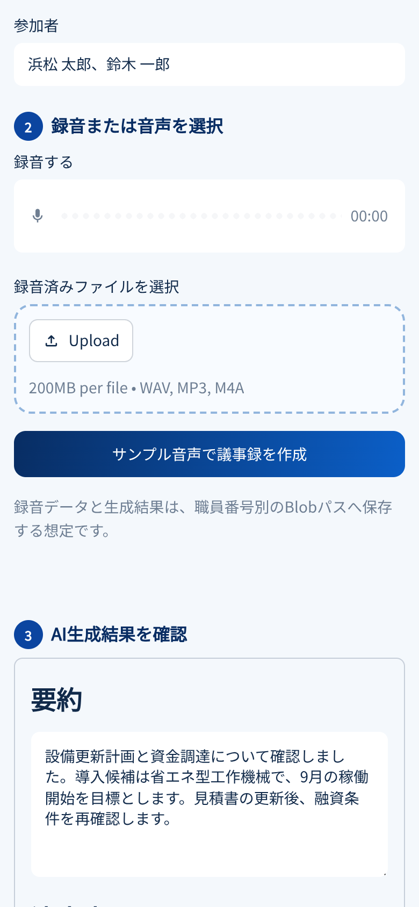
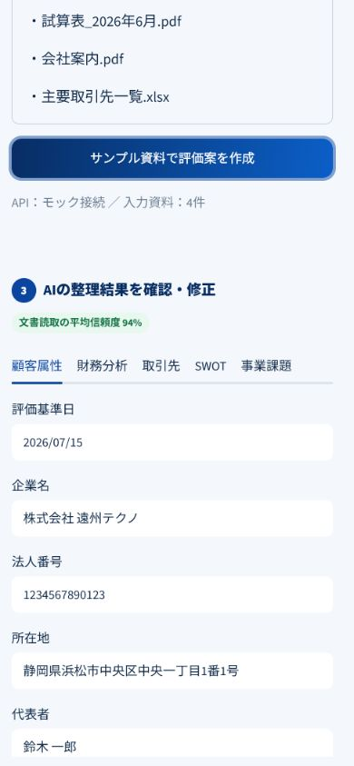

# AI業務アシスト Streamlit画面モック

決算書PDFと参考資料から事業性評価シートを作成する画面と、音声から議事録を作成する画面を確認するためのStreamlitモックです。現時点ではAzure AI、Blob Storage、FastAPIへ接続せず、固定のサンプルデータで画面遷移とExcel生成を確認します。

このモックは将来のアプリ像を共有するためのものです。案件書のフェーズ2「Spoke土台」にはデプロイされません。ACR、Container Apps、Managed Identity、RBACを追加するフェーズ4で、バックエンドと認証を実装してから閉域Azureへ配置します。

## 画面イメージ

| ホーム | 事業性評価 | 音声議事録 |
|---|---|---|
|  |  |  |

評価案を作成すると、5つの評価領域をタブで確認・修正できます。



## 事業性評価シートの処理イメージ

```text
決算書PDF・試算表・会社案内・取引先資料
  ↓
Azure AI Document Intelligence
  文字、表、数値を読み取る
  ↓
Azure OpenAI
  事業性評価の項目へ整理し、分析案を作る
  ↓
職員による原資料との照合・修正
  ↓
事業性評価シート.xlsx
```

Document Intelligenceは「資料に何が書かれているかを読み取る」役割です。Azure OpenAIは、その読取結果を事業性評価で使う項目へ整え、財務傾向、SWOT、課題の下書きを作る役割です。最終判断をAIへ任せず、Excelの各行は初期状態を `要確認` とします。

生成するExcelブックは次の6シートです。

| シート | 主な内容 |
|---|---|
| 評価サマリー | 入力資料、処理サービス、5領域の概要、確認状態 |
| 顧客属性 | 企業名、所在地、代表者、業種、創業、資本金、従業員数、主要事業等 |
| 財務分析 | 3期分の売上高、利益、利益率、自己資本比率、有利子負債、債務償還年数とAI評価 |
| 取引先 | 販売先・仕入先、取引比率、決済条件、集中度や調達上のリスク |
| SWOT分析 | 強み、弱み、機会、脅威と、その評価根拠 |
| 事業課題 | 優先度、課題、背景、対応案、確認に使うKPI |

## 初心者向け: 何がモックなのか

| 部分 | 現在の動作 | 本番で置き換えるもの |
|---|---|---|
| ログイン | 環境変数の一時コードと照合 | FastAPI、オンプレミスAD、Microsoft Entra ID等 |
| 文書読取 | 固定の決算書・参考資料名と評価データを表示 | Azure AI Document Intelligence |
| 項目整形・分析 | 固定の財務評価、SWOT、事業課題を表示 | Azure OpenAIと承認済みプロンプト |
| 音声処理 | 固定の要約・決定事項を表示 | Speech、要約モデル等 |
| 履歴 | Streamlitのメモリ内だけ | データベースまたは承認済みの永続ストア |
| ファイル保存 | 保存しない | Private Endpoint経由のBlob Storage |
| 監査ログ | ブラウザーセッション内だけ | 改ざん防止と保持期間を設計した監査ログ |

画面に表示される会社名、氏名、件数、処理結果はすべてサンプルです。

## ローカルで起動する

Python 3.11または3.12を使用します。リポジトリのルートから次を実行してください。

動作確認済みのStreamlitとopenpyxlを `requirements.txt` で固定しています。更新時は単体テストと画面確認をやり直します。

```powershell
cd app
python -m venv .venv
.venv\Scripts\Activate.ps1
python -m pip install --upgrade pip
python -m pip install -r requirements.txt

$env:AUTH_MODE = "temporary"
$env:DEMO_MODE = "true"
$env:TEMP_LOGIN_CODE = "ローカル確認専用の値"

streamlit run app.py
```

ブラウザーで `http://localhost:8501` を開きます。職員番号は `123456`、ログインコードは上で設定した `TEMP_LOGIN_CODE` の値です。

`TEMP_LOGIN_CODE` をファイルへ直書きしたり、`.env` をGitへ登録したりしないでください。`.env.example` は変数名だけを確認する見本です。Streamlitはこのファイルを自動では読み込みません。

## Dockerで起動する

```powershell
docker build -t ai-work-assist-ui:local ./app
docker run --rm -p 8501:8501 `
  -e AUTH_MODE=temporary `
  -e DEMO_MODE=true `
  -e TEMP_LOGIN_CODE="ローカル確認専用の値" `
  ai-work-assist-ui:local
```

## テスト

```powershell
cd app
python -m unittest discover -s tests -v
```

## ディレクトリ

```text
app/
├─ app.py                  # Streamlitの画面とページ遷移
├─ services/
│  ├─ auth.py             # PoC用認証境界
│  ├─ api_client.py       # 将来のFastAPI接続境界
│  ├─ excel_service.py    # 6シートの事業性評価Excel生成
│  └─ mock_data.py        # 事業性評価と議事録の固定サンプルデータ
├─ ui/
│  ├─ components.py       # 共通画面部品
│  └─ theme.py            # Streamlit用CSS
├─ tests/                 # Azureへ接続しない単体テスト
├─ docs/screenshots/      # 画面イメージ
├─ .streamlit/config.toml
├─ Dockerfile
└─ requirements.txt
```

## 本番化の前に必ず行うこと

- 暫定認証をFastAPIまたは承認済み認証基盤へ移す
- アップロード拡張子だけでなく、サイズ、MIME、実体、マルウェアを検査する
- StreamlitからAzure資格情報やStorage Keyを直接扱わない
- Managed Identityと最小権限RBACでAzureサービスへ接続する
- 職員がAI結果を確認・修正してから確定する
- 履歴、監査ログ、保存期間、削除、バックアップを設計する
- 依存ライブラリの脆弱性とコンテナイメージを検査する

アプリとAzure基盤の対応関係は [`../terraform/solution/docs/application-boundary.md`](../terraform/solution/docs/application-boundary.md) を参照してください。

## 公式資料

- [Streamlit `st.audio_input`](https://docs.streamlit.io/develop/api-reference/widgets/st.audio_input)
- [StreamlitをDockerでデプロイする手順](https://docs.streamlit.io/deploy/tutorials/docker)
